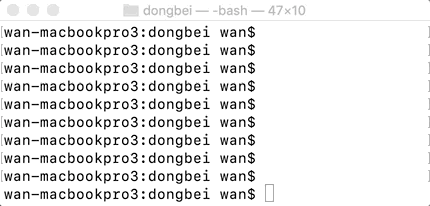
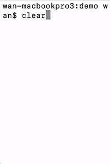
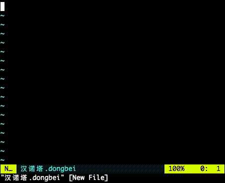

# dongbei - 东北方言编程语言

dongbei 语言永久域名：http://dongbei-lang.org/

学编程，就整东北浪！

> Make dongbei Great Again !!!

#### 体格咋地

[](https://travis-ci.com/zhanyong-wan/dongbei)

扫码关注原作者微信公众号“老万故事会”：


* [引言](#引言)
* [系统要求](#系统要求)
* [安装](#安装)
* [跑程序](#跑程序)
* [测试](#测试)
* [吃了没，老铁](#吃了没老铁)
* [学习材料](#学习材料)
* [参与开发](#参与开发)
* [周边](#周边)

## 引言

dongbei 是啥？它是一门*以东北方言词汇为基本关键字的以人为本的编程语言。*

这玩意儿可是填补了世界方言编程地图上的一大片儿空地啊！
这么说吧，谁要是看了 dongbei 程序能憋住了不笑，我敬他是纯爷们儿！

那它有啥特点咧？多了去了：

*  简单啊！小学文化程度就行。您能看懂春晚不？能？那就没问题。
*  好读啊！看着看着包您不由自主地念出声儿来。
*  开心啊！呃，做人嘛，最重要的是要开心。
*  开源啊！不但不要钱，而且不要脸 -- 随时随地欢迎东北话高手打脸指正。

总而言之，dongbei 语言具有极高的**娱技比**（娱乐精神-技术含量比例）。

dongbei 编程语言的开发采用了业界领先的 **TDD（TreeNewBee-Driven Development）** 方式。
具体地说，就是每个功能都是先把文案写好，八字没一撇牛皮就吹起来了，然后根据牛皮写测试案例，最后再实现功能让牛皮不被吹破。
这样做有两大好处：第一每个功能都是有的放矢，不值得 tree new bee 的功能一概没有。
第二确保了每个功能都有文案负责吹嘘，开发者绝对不会养在深闺无人识。

自 dongbei 语言发布以来，到哪儿都受到银民群众的热情赞誉，滔滔江水罄竹难书。
兹摘录评论数则：

*  “陈独秀比起你来都差点。”
*  “也太无聊了吧。”
*  “劲太大了，给我整上头了。”
*  “作者可以去中科院了。”
*  “把我头笑掉了你拿什么赔？！”
*  “寻思看个文章我咋自动带入语音了害？”
*  “哈哈哈哈感觉我要爱上编程了哈哈哈。”
*  “你这不像是编程语言，更像是语音助手。。飙泪笑”
*  “这都要从一只蝙蝠说起。。。”
*  “过于沙雕。”
*  “中科院点了个赞.jpg”
*  “千万资金属于你。”
*  “我搁家躲病毒，圈得五脊六兽的，一看着这玩意儿，齐了咔嚓地就给它念完了！这家伙，早前儿电脑要有这好玩意儿也不至于程序一捅咕上就跟划不开拐抢不上潮似的！”
*  “东北从此有四宝。”
*  “就想问问是不是在家闲出病来了。”
*  “这种东西编译器课程认真做作业的花点时间都能捣鼓出来吧。”
*  ”咱这东北老爷们儿这不都给你们这帮憋犊子祸害成整电脑的了。“
*  ”无聊，和农民造飞机一个德行。“
*  ”还是静下心来做真正的研发吧，老实说，中国已经过度的娱乐化了，现在连技术都要娱乐化吗？一个翻译语法的外壳而已，咱们不可能靠这些娱乐化的东西来打退别人的技术封锁，更不可能造成战略优势的！“
*  “来人啊，又憋疯一个！”

看到这里，你是不是已经按捺不住，急赤白咧，上蹿下跳了呢？
不扯犊子了。
翠花，上酸菜～～～

## 系统要求

dongbei 语言是基于 Python 3 二次开发的。
只要能跑 Python 3 的旮旯儿都能跑。
像 macOS 啦、Windows 啦、Linux 啦，等等等等，都成！

## 安装

### 安装 python3

要是你的系统还没装 python3 呢，那得先装一个，免费！

比如，你要是用 Mac 的话，就按 [Mac Python3 安装指南](https://docs.python-guide.org/starting/install3/osx/) 来。

### 安装 dongbei

clone 或者下载这个 dongbei 仓库之后，就可以直接跑 src/dongbei.py 了！

要是想更方便呢，建议用 pip3 装 dongbei-lang，完了可以直接用 dongbei 命令跑程序。

#### 安装 pip3

要是你的系统没有 pip3 呢，也可以装一个，还是免费。详情可咨询：
[Windows](https://blog.csdn.net/menc15/article/details/65631380),
[Mac](https://blog.csdn.net/huangpin815/article/details/70194492),
[Ubuntu](https://www.jianshu.com/p/a0dd650dbd41)。

#### 用 pip3 安装 dongbei

装好 pip3 后就可以装 dongbei-lang 了：

```{shell}
# 给这台电脑的所有用户安装
pip3 install dongbei-lang

# 只给自己安装
pip3 install dongbei-lang --user

# 更新到最新的 dongbei 版本。要是只给当前用户更新，加 --user
pip3 install dongbei-lang --upgrade
```

装好了就可以这么用了：

```{shell}
dongbei <xxx>.dongbei
```

没有虚拟环境忒费劲，用虚拟环境整一下：

```
$ python3 -m venv venv
$ source venv/bin/activate
$ pip install -r requirements.txt
```

然后找个例子比划比划：`dongbei --bihua 磨叽`

## 唠嗑

学 dongbei 最快速的方法是跟大哥唠嗑。这种方式不用编程就可以上手，现学现用。

打开唠嗑模式很简单。要是你已经安装了 0.0.16 版以上的 dongbei-lang，只需

```{shell}
dongbei
```

要是你只是克隆了 dongbei 代码仓库，还没有安装 dongbei-lang，就整

```{shell}
src/dongbei.py
```

做完以上操作，你应该看到

```
你要跟 dongbei 大哥唠嗑啊？开整吧！要是一句话太长咧你就用\拆开唠。
你瞅啥？
```

这时你只要用 dongbei 话告诉大哥你想瞅啥就行。比如：

```
你要跟 dongbei 大哥唠嗑啊？开整吧！要是一句话太长咧你就用\拆开唠。
你瞅啥？ 三加二减五
0
```

大哥会算术，知道三加二减五等于零。

要是一句话太长咧，可以用反斜杠拆开唠。比如：

```
你瞅啥？ 三加\
你还瞅啥？ 二减五
0
```

也可以多唠几块钱儿的。dongbei 大哥记性好，你说了啥都记着呢：

```
你瞅啥？ 老王装二!
你瞅啥？ 老王走两步!
你瞅啥？ 老王
4
```

等你熟悉 dongbei 就明白了，这段嗑唠的是：先让老王装个 2，再让他加个 2，然后一瞅老王，现在是 4 了。

等你不想唠了，只需问候大哥“瞅你咋地”，他就不跟你再掰豁了：

```
你瞅啥？ 瞅你咋地
完犊子了！
```

## 跑程序

目前人类已知的跑 dongbei 程序的方法有三种：

1. 要是没有用 pip3 安装 dongbei-lang，可以用 `src/dongbei.py 程序文件` 命令来跑一个 dongbei 程序。
2. 要是已经安装了 dongbei-lang，可以用 `dongbei 程序文件` 命令。
3. 要是已经安装了 dongbei-lang，也可以在一个 dongbei 程序文件的开头插入一行 `#!/usr/bin/env dongbei` 再把文件改成可执行的（比如在 Linux / macOS 上跑 `chmod +x 程序文件`）。然后，就可以直接用 `程序文件` 命令来跑码了。

用前两种方法的时候，可以在命令行加上 `--xudao`（絮叨）让系统打印和 dongbei 程序对应的 Python 代码。
这在开发和学习 dongbei 的时候大有裨益。

但假如你现在还没修炼出一手正宗的大碴子味代码，但又想一品正宗 dongbei 味儿，欢迎使用`--bihua`直接上手运行我们提前准备好的精选dongbei代码合集。毕竟 dongbei 精神就是要能上手，绝不bibi。
```
$ dongbei --bihua 斐波那契
执行 dongbei 案例: 「斐波那契」

瞅瞅0的结果：
你整的啥输入啊？
瞅瞅15的结果：
1、1、2、3、5、8、13、21、34、55、89、144、233、377、610
```

## 测试

没事跑跑

```{shell}
test/dongbei_test.py
```

身体更健康。

## 吃了没，老铁

创建一个名字叫 `hello-world.dongbei` 的文本文件，内容如下：

```{text}
嘀咕：“唉呀，这嘎哒真他妈那啥！”。
```

用 UTF-8 编码保存。
要是编辑器因为编码有毛病埋汰你，那就把文件内容改成

```{text}
# -*- coding: utf-8 -*-

嘀咕：“唉呀，这嘎哒真他妈那啥！”。
```

再试，应该就成了。

然后在命令行窗口运行：

```{shell}
dongbei hello-world.dongbei
```

你应该看到执行结果：

```{text}
唉呀，这嘎哒真他妈那啥！
```

## 学习材料

要是你以前有 dongbei 语言基础，或者不耐烦看文档，可以直扑 [dongbei 语言考试小抄](doc/cheatsheet.md)。

要是你习惯以听歌的方式学习，请下载 dongbei 语言官方宣传歌曲[《Dongbei Style》](doc/Dongbei%20Style.mp3)（[歌词](doc/dongbei-style.md)）。

要是你想全面深入掌握 dongbei 语言，那就得读读 [dongbei 语言咬文嚼字](doc/dongbei-ref.md)。

这里还有一些精选的示范程序供大家参考：

* [快速排序](demo/快速排序.dongbei)
* [汉诺塔动唤](demo/汉诺塔动唤.dongbei)。运行结果：
  <br/>
* [活着](demo/活着.dongbei)。运行结果：
  <br/>

## 参与开发

dongbei 欢迎大伙儿帮衬。
要是您有意相助，请看 [dongbei 开发人间指南](DEVELOPE.md)。

## 周边

一个好汉三个帮。
dongbei 的老铁们开发了这些个周边项目，让你在用 dongbei 编程的时候如虎添翼，如鱼得水，如痴如醉，如胶似漆：

* VS Code 的 dongbei 语法高亮度插件：https://github.com/mingjun97/dongbei-vscode ，在插件商店[直接安装](https://marketplace.visualstudio.com/items?itemName=mingjun97.dongbei)就成。
* vim 的 dongbei 语法高亮度插件：https://github.com/suxpert/dongbei.vim ，整法自个儿瞅去。
  效果示例：<br/>

还有上海宁把 dongbei 本地化搞了个上海话版：https://github.com/cabuliwallah/shanghai-from-dongbei  
四川哥子模仿 dongbei 弄了个四川编程语言: https://github.com/AoiKuiyuyou/SichuanLang.git  
又有位高中生凑热闹整了个粤语编程语言: https://github.com/StepfenShawn/Cantonese.git  
